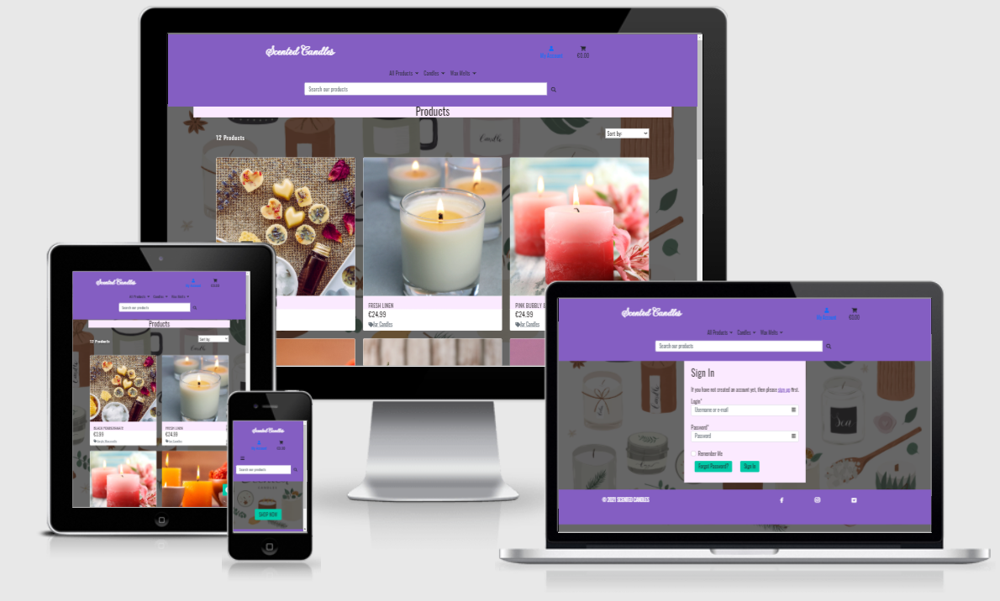
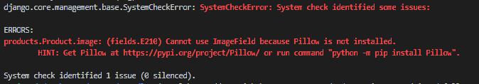
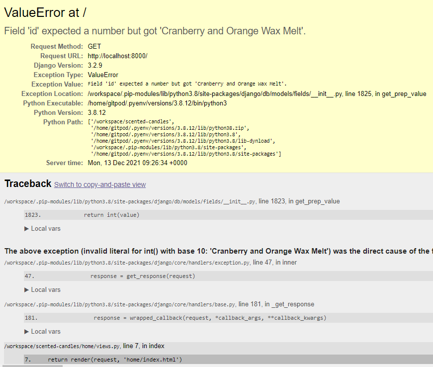

# **Scented Candles**

[Live Website](https://scented-candles-ms4.herokuapp.com/)

[GitHub Repository](https://github.com/RCass172/scented-candles)

---

# **Table Of Contents**
- [Introduction](#introduction)
- [User Experience](#user-experience)
  - [User Stories](#user-stories)
  - [Wireframes](#wireframes)
  - [Design](#design)
- [Features](#features)
  - [Current Features](#current-features)
  - [Future Features](#future-features)
- [Database](#database)
- [Technologies Used](#technologies-used)
  - [Languages](#languages)
  - [Frameworks And Libraries](#frameworks-and-libraries)
- [Testing](#testing)
- [Deployment](#deployment)
- [Credits](#credits)
- [Acknowledgments](#acknowledgments)

---

# **Introduction**

Scented candles is an e-commerce website I have created for my milestone 4 project. It allows users to view the business products, which include candles and wax melts, allowing them to securly purchase any of the products online. This in turn allows the business to advertise and showcase their products and helps to increase their revenue.

---

# **User Experience** 

## **User Stories**

As a user I would like:

1. To easily navigate throughout the website
2. To easily determine what the website is for on first inspection
3. To be able to view the website responsively on any device
4. To be able to view a list of available products
5. To be able to view the individual product information for each
6. The ability to search for specific products by name or description
7. To be able to sort the list of products as needed
8. The ability to select the quantity of products when purchasing 
9. To easily view products in shopping basket along with individual price and total
10. To easily see the shopping basket total at all times
11. The ability to change product quantities in the shopping basket
12. The ability to enter payment details securely when purchasing
13. To be able to register an account
14. To be able to easily log in or out of account
15. The ability to view payment info when logged in as a general user
16. The ability to view order history when logged in as a general user
17. To easily add a new product, edit a product or delete a product when logged in as an admin user
18. The ability to tell when successfully purchased a product

## **Wireframes**

Here are the wireframes for each page:

[Home Page](readme/wireframes/Homepage.png)
[Products](readme/wireframes/Products-page.png)
[Product Information](readme/wireframes/Product-details.png)
[Sign In / Register](readme/wireframes/SignIn_Register.png)
[Profile](readme/wireframes/Profile.png)
[Shopping Cart](readme/wireframes/Shopping-cart.png)
[Checkout](readme/wireframes/Checkout.png)
[Manage Products](readme/wireframes/Manage-products.png)

## **Design**

For the colors I used the palette below using purples for the main content and navbar and the green for the buttons to stand out. The colors blend well together and match the overall theme of colorful candles being sold

I used a hero image to cover the body of the pages and it can be seen on all pages for consistancy and relevancy

For the fonts I linked GoogleFonts into the pages, using Oswald for the main text and Gwendolyn for the Logo text to stand out, as they both look well together

---

# **Features**

## **Current Features** 

### **Registered And Non Registered Users**

- Navigation Bar
  - The website has a fixed navbar with clickable logo and website name which will take the user back to the homepage
  - There is a dropdown for all products, candles and wax melts with the ability to sort the products
  - There is a search bar for users to easily find a certain product
  - There is a register and login button for users depending if it's a new or returning user
  - There is a shopping cart that shows up to date total
  - The navbar is responsive when on small devices with menu items being shown once the burger icon is clicked

- Responsive Layout
  - The layout is responsive on all different sized devices from mobiles to desktops, in order to make all content easily readable and for best aesthetics

- Buttons
  - All buttons were styled the same for a consistant look throughout the website
  - On hovering over any button the colors will be inverted to give visual feedback to the user

- Back To Top
  - I created a back to top button which shows once the user scrolls down through the products. This is in order for the user to easily navigate back to the top of the page if needed

- Shopping Cart
  - The shopping cart allows users to easily update or remove an item from their cart or go ahead and checkout

- Checkout Page
  - The checkout page allows users to enter their shipping details
  - Stripe is used to allow users to make a payment

- Footer
  - The footer which is fixed to the bottom of page includes the social media links for user to follow. These links use a hover effect for visual feedback and on clicking will open a new tab

### **Registered Users Only**

All registered users have all the above features with added:

- User Profile
  - On registering or logging in, a user can go to their profile to update shipping details or see past orders.
  - An added nav menu item of "Sign Out" is now visible to users logged in to easily logout.

### **Admin User**

Once logged in as an admin user all the above features are relevant plus:

- Manage Products
  - Once admin users are logged in they can add a product easily to a relevant category
  - On the product pade and individual product info pages the admin user can easily edit or delete a product
  - This now completes the basic CRUD functions of allowing a user to create, read, edit and delete products.

## **Future Features**

- Ratings and Reviews
  - I would love to add a rating system to each product with the ability for users to leave a review once they have purchased a product.

- Extra Add Functionality
  - I would like to add the functionality to admin users of adding new categories to the store.

- Toast Messages
  - Unfortunately I didn't have time to set up the toast messages to display to users. This is a feature I would like to add in order to give users visual feedback of their actions throughout the pages.

---

# **Database**

  `*` shows the relationship between the entities

- Categories
  - Category_Name*

- Products
  - Category_Name*
  - SKU
  - Product_Name
  - Description
  - Price
  - Image_url
  - Image

---

# **Technologies Used**

## **Languages**

- [HTML5](https://en.wikipedia.org/wiki/HTML5)
- [CSS3](https://en.wikipedia.org/wiki/Cascading_Style_Sheets)
- [JavaScript](https://en.wikipedia.org/wiki/Javascript)
- [Python](https://en.wikipedia.org/wiki/Python_(programming_language))
- [Jquery](https://en.wikipedia.org/wiki/JQuery)

## **Frameworks And Libraries**

- [Bootstrap v4.5.0](https://getbootstrap.com/) - Creates a responsive layout.
- [Font Awesome](https://fontawesome.com/) - Adds icons throughout.
- [Cloud Convert](https://cloudconvert.com/webp-converter) - Convert images to smaller size.
- [Google Fonts](https://fonts.google.com/) - Imports fonts used.
- [Django](https://docs.djangoproject.com/en/3.2/) - Python framework.
- [Heroku](https://www.heroku.com/) - Deploys the app.
- [Stripe](https://stripe.com/) – Allows payments to be done over Internet.
- [AWS](http://aws.amazon.com/) - Amazon Web Services
- [Git](https://git-scm.com/) - Version control.
- [Github](https://github.com/) - Hosts the project files.

---

# **Testing**

Testing was carried out along the way of developing the site with fixes made throughout, along with the following tests to ensure everything was working was expected and any bugs were fixed to the best of my ability.

## **Testing the user stories**

1. To easily navigate throughout the website
    - A navbar on all pages allows easy navigation throughout all the pages with links to each page clearly stated and shown
2. To easily determine what the website is for on first inspection
    - On arriving to the homepage the user is met with the name, which clearly states what kind of products there is, and a call to action button to shop which tells the user that it is used to purchase the products
3. To be able to view the website responsively on any device
    - Device testing as below was carried out to ensure all the pages looked as expected on different sized devices
4. To be able to view a list of available products
    - A products page is present which allows the user to browse all products available or sort into certain categories
5. To be able to view the individual product information for each
    - On clicking into a product, the user is brought to a separate page to view all the information on each product
6. The ability to search for specific products by name or description
    - A search bar is present on the navbar on all pages to easily allow users to search for any specific product by name or description
7. To be able to sort the list of products as needed
    - There are links to sort products by cost or category, or the ability to sort each individual category to allow users to find anything specific
8. The ability to select the quantity of products when purchasing 
    - When clicked into an individual product the user can select the quantity to add to the cart using the plus and minus buttons
9. To easily view products in shopping basket along with individual price and total
    - The shopping cart page is present which displays the price and totals of individial products in an order 
10. To easily see the shopping basket total at all times
    - A shopping cart link is placed on the navbar to easily allow users to see the total of their cart at all times
11. The ability to change product quantities in the shopping basket
    - Once product is added users can go to the shopping cart where they can easily change the quantity of each product as needed using the buttons
12. The ability to enter payment details securely when purchasing
    - On the checkout page a secure payment details input using Stripe allows the user to enter their card details securely to purchase products
13. To be able to register an account
    - A separate register page is present to allow users to enter their email, username and password to create an account and allow users to save their delivery information and past orders. This register link is only present where users are currently not logged in.
14. To be able to easily log in or out of account
    - A separate login page is present to allow users to enter their details and sign in. Once signed in a sign out link is displayed in the nav bar. This login link is only present where users are currently not logged in
15. The ability to view payment info when logged in as a general user
    - When logged in the user can go to their profile page where they can easily view their delivery information
16. The ability to view order history when logged in as a general user
    - When logged in the user can go to their profile page where they can easily view their order history information
17. To easily add a new product, edit a product or delete a product when logged in as an admin user
    - Once logged in as an admin user the navbar contains a link to the manage products page where they can add a product to the database. By clicking onto the products page or on an individual product information page, the admin user has an update and delete button which allows them to carry out each task and therefore allowing the CRUD functionalilty
18. The ability to tell when successfully purchased a product
    - Once a user submits a purchase by checkout in the cart, they are shown the checkout success page which displays the order details

## **Testing Functionality**

- Testing was done on all the features of the website to make sure everything was workiong as expected. 
- Links were checked to make sure opened correctly with no broken links. External links such as the social media icons all opened in a new tab as expected. All internal links checked to make sure correct pages opened when clicked. 
- CRUD functions were tested to ensure products we easily created, read, updated and deleted as expected. 
- The checkout page was tested to make sure stripe was working to allow users to purchase products.
- Family and friends were asked to check all aspects of website to check for any errors or bugs.
Overall I was happy everything functioned as it should.

## **Testing Responsiveness**

- **Device testing**

The website was tested using Google Chrome's Dev Tools to check if the website displayed well on all devices below:

  1. Moto G4
  2. Galaxy S5
  3. Pixel 2
  4. Pixel 2 XL
  5. IPhone 5/SE
  6. IPhone 6/7/8
  7. IPhone 6/7/8 Plus
  8. IPhone X
  9. IPad
  10. IPad Pro
  11. Surface Duo
  12. Galaxy Fold
  13. Nest
  14. Nest Hub Max

_Results were good and as expected_

- **Operating system testing**

The website was tested on real devices with the following OS:

  1. Windows 10
  2. Android
  3. IOS

_Results were good and as expected_

- **Browser testing**

The website was tested on the following browsers:

  1. Google Chrome
  2. Microsoft Edge
  3. Opera
  4. Firefox
  5. Vivaldi

_Results were good and as expected_

## **Bugs And Fixes**

- When Pillow was installed I found myself having to install it again once Gitpod was reopened even though it was saved in the requirments.txt file. After searching on slack I found the fix [here](https://lechien73.github.io/reqfix/) which explained it was a corrupted requirements.txt from the Gitpod template I had used. Once I saved the new requirements file it worked as expected.

- I came across a Page not found (404) error when I was testing the delete function on a product. As I came to learn, this product was in my basket and once deleted it still remained in the bag due to the browser cache. Once I cleared the browser data I was able to get the site working again.

- I got a ValueError when trying to set up the adjust and remove views in the cart. After going over the code I realised I had product_id where it should have been item_id and also, as before, a clearance of the browser data and the cart worked as expected.

---

# **Deployment**

## Heroku Deployment 

Setup your Heroku workspace:

1. Navigate to Heroku.com and login.
2. Create a new app.
3. Click the deploy tab and select GitHub.
4. Enter the repository name for the project and search.
5. Click the connect button.
6. Click on the settings and 'reveal config vars', to set environment variables.

Enable automatic deployment by:

1. Clicking the Deploy tab.
2. Choose main branch and click 'Enable Automation Deploys'.

Add a PostgreSQL Database:

1. Click the resources tab.
2. Search for Heroku Postgres and click.
3. Select Plan name 'Hobby Dev - Free' and then click 'Submit Order Form'.

---

# **Credits**

Code Institute's Boutique Ado was used as a basis for creating this e-commerce website.

Images were taken from Shutterstock at the following links:

- [red-melt](https://www.shutterstock.com/image-photo/four-red-yellow-melted-wax-crayon-1776057728) By Cat Hammond
- [yellow-melt](https://www.shutterstock.com/image-photo/making-mini-wax-melts-aroma-lamp-1869745792) By FotoHelin
- [purple-melt](https://www.shutterstock.com/image-photo/wax-aroma-purple-beige-brown-cubes-1454469629) By Zlata Kibalko
- [hero-img](https://www.shutterstock.com/image-vector/collection-modern-scented-candles-made-soy-1988383496) By Ksenia Zvezdina
- [orange-candle](https://www.shutterstock.com/image-photo/composition-spa-treatment-on-table-247525399) By SunKids
- [red-candle](https://www.shutterstock.com/image-photo/beautiful-candles-flowers-on-wooden-background-187095053) By Africa Studio
- [white-candle](https://www.shutterstock.com/image-photo/luxury-lighting-aromatic-scent-glass-candle-1759435055) By Enjoy The Life 
- [purple-candle](https://www.shutterstock.com/image-photo/spa-setting-candle-salt-dried-flower-228917233) By grafvision
- [green-candle](https://www.shutterstock.com/image-photo/burning-candle-pinecone-scent-on-black-1892732620) By New Africa

Content from the products were taken from [Candle Shack](https://candle-shack.co.uk/)

The fix for the Pillow errow was taken from [here](https://lechien73.github.io/reqfix/)

---

# **Acknowledgments**

I would like to thank Code Institute for this great learning experience along with the very helpful mentor and tutors along the way.

To my family and friends who helped provide great and honest feedback throughout the project.

And finally thanks to the slack community for whenever I got stuck on (many) a problem, research (mostly) always pointed me in the right direction.
